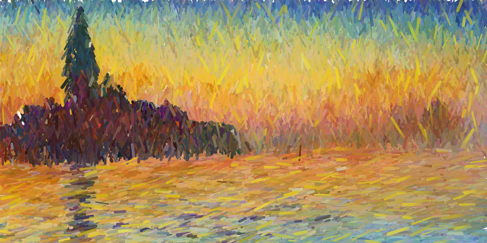
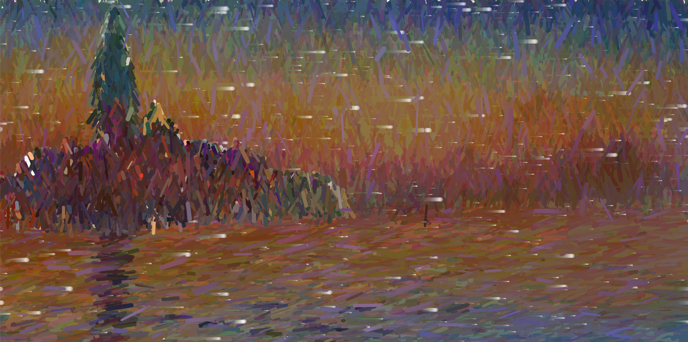
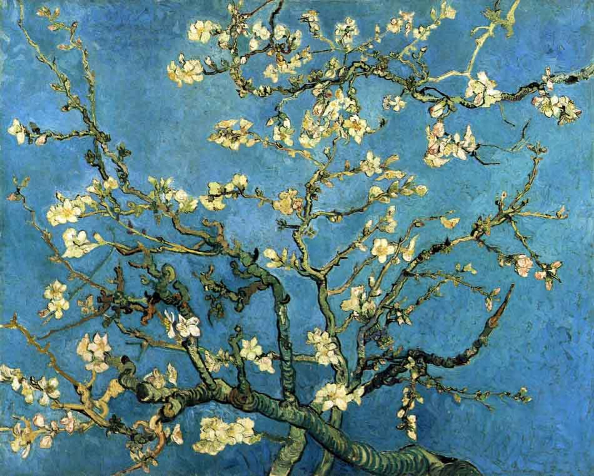
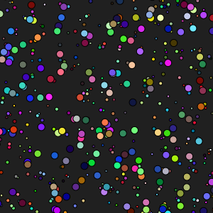

# fliu0820_tut3_groupE Creative-coding-major-project



**Instructions for use**

The project will start playing automatically after running, looping every 30 seconds

**Project Introduction:**

This project is based on Claude Monet's work "Saint Georges majeur au crépuscule", through the use of dynamic colour changes and animation effects, reproduces the work and its creative process. An animated screen with dynamic lines and background stars was created using p5.js. The lines in the animation take their colours from the background and the image of the tower and change dynamically over time.

**Animation method for individual tasks**

The animation method I chose is time-driven (time-based). The line colours change dynamically over time, while the background stars move horizontally, creating a dynamic background effect. Specifically, the line colours will transition over time within a specified range of colours, with a transition effect period of 1800 frames. The transition sequence is: yellowish -> yellow -> red -> blue -> red -> yellow -> yellowish, to simulate the light change of the day.

**Technical details**

***The dynamic line colour change and background star movement is achieved by frameCount, a global variable in p5.js.***

- ***Colour transitions:***
  
  In each frame, the frameCount is first calculated relative to the progress of the colour change period colorChangePeriod, which is implemented in the getDynamicColor function, which interpolates between different colours based on the value of progress, and uses the lerpColor function to Smoothly changes the colour.

  ```
  function getCurrentTransitionColor() {
  let phase = frameCount % colorChangePeriod;
  let progress = phase / colorChangePeriod;

  let c;
  let progress1 = 1 / 6;
  let progress2 = 2 / 6;
  let progress3 = 3 / 6;
  let progress4 = 4 / 6;
  let progress5 = 5 / 6;
  let progress6 = 1;
  ...
  }

  ```


- ***Dynamic colour application:***
  
  Dynamic lines are drawn by first picking up the colour from the background image and changing the colour over time. The properties of the line are defined by the Line class and include properties such as position, colour, thickness, direction and speed. The position of the line is updated by the update method to move it around the screen and achieve dynamic effects. The getDynamicColor function applies the current transition colour, allowing the line colour to change dynamically.

   ```
  function getDynamicColor(col) {
  let c = getCurrentTransitionColor();
  let r = lerp(red(col), red(c), 0.5);
  let g = lerp(green(col), green(c), 0.5);
  let b = lerp(blue(col), blue(c), 0.5);

  return color(r, g, b);
  }
  
  ```


- ***Background stars movement:***
  
  The background stars will move horizontally, through the frameCount to control the speed and direction of movement, to form a dynamic background effect. The background stars will move horizontally, and the frameCount will control the speed and direction of the movement to form a dynamic background effect.

  

 ```
 function drawWhiteCircles(dynamicTint) {
  fill(255, 255, 255, 120 + (dynamicTint * -1)); // Set fill color to white with dynamic transparency
  noStroke();
  ...
 }

 ```

**Inspiration for the development of this project:**



Almond Blossoms *Vincent van Gogh*
  
Vincent van Gogh's painting techniques and colour choices.



The following code was referenced during the creation process
  
[Link to ***Happy Coding - p5.js Creating Classes: Parallax Dots*** page](https://happycoding.io/tutorials/p5js/creating-classes/parallax-dots)